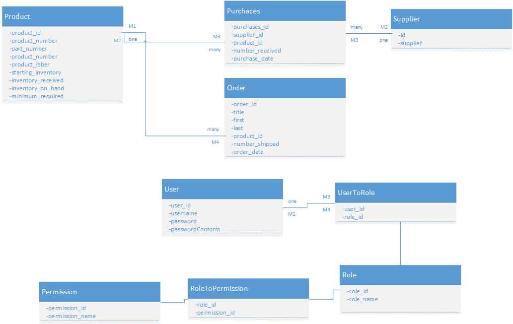

# Inventory manageminent project

### backend service
registeration and logging

user managiment 
CRUD

product managiment 
CRUD
Custom query method and controller class for these query,
overload it by writing queryItem(paramiter,parameter, ...)
[Source code](/InventorySystemEurekaService)
### Data Model
 0.1

